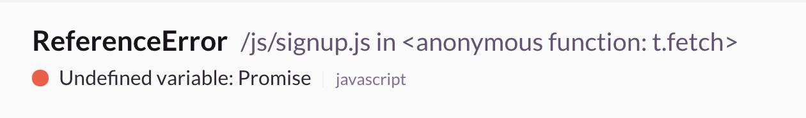
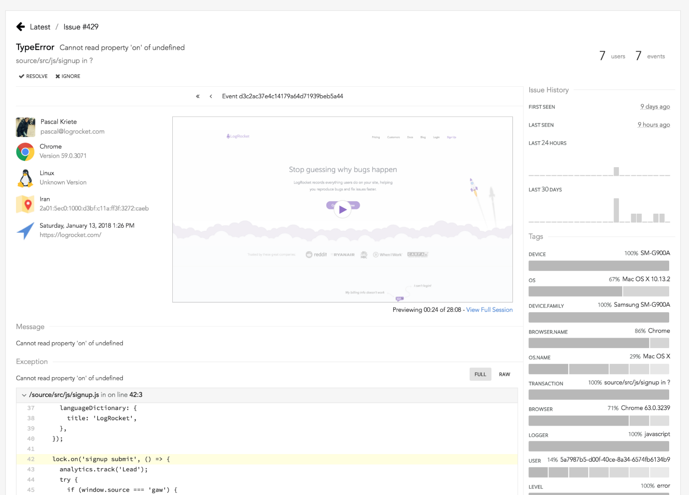
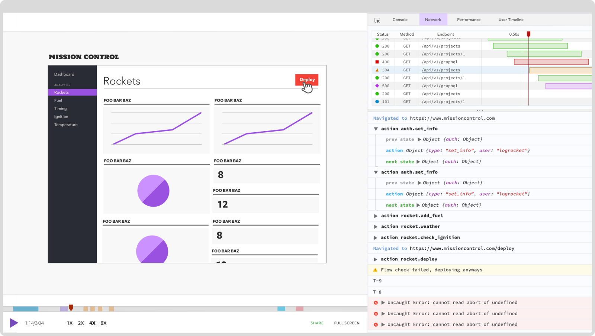
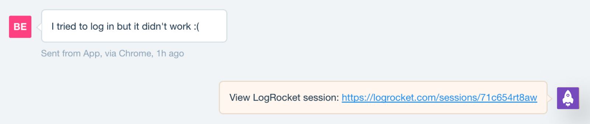
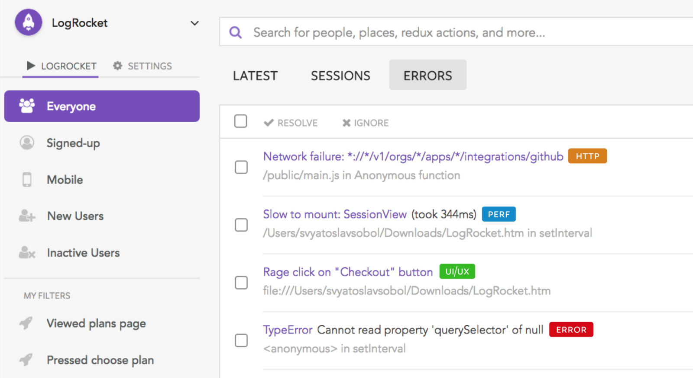

## 【翻译】LogRocket

> 最近在研究前端错误日志上报，搜到了这篇介绍LogRocket的文章，公司内部有些前端错误日志上报系统是用Sentry实现的，这个工具提供了一个新的思路，所以一（xian）时（de）兴（fa）起（huang）翻译了一下

> 原文地址：[https://blog.logrocket.com](https://blog.logrocket.com/rethinking-front-end-error-reporting-659db3950db3)

正文开始 ===>

### 前端错误日志上报思考

明白web应用的报错是很困难的，这是一个持续的斗争去在这些问题影响到用户体验之前就能将这些神秘的JavaScript error，用户上报bugs，和QA里创建的issues fixed掉。

传统的错误上报工具（比如BugSnag，Sentry，和Roolbar），只解决了其中的部分问题。这些工具一开始是为记录服务器端日志而设计的，后来随着前端应用变得越来越复杂，它们添加了浏览器SDK。当这些工具捕获到了一些有用的信息，如stack traces和metadata，很多团队发现它们的提醒过于密集（太多无用的误报了），而且它们并不能捕获到足够的能够解释复杂问题的上下文信息。

#### 前端是不一样的

研究前端和后端的错误日志是非常不一样的过程。

服务器端的代码是在一个平台运行，在通常的情况下，系统中唯一可能导致难以重现错误的状态来自轻松记录的事件，如数据库或缓存查询。 当服务器代码发生未处理的异常时，通常意味着需要修复一个明确的问题。

但是在前端，事情并没有这么简单。平均的web应用程序运行在超过15个不同的浏览器上，数百种设备类型。这样会导致代码的状态可能非常复杂，来自内存，本地存储，本地数据库，服务器进程和API。所以一个webapp必须兼容连通性和跨浏览器的差异，而且不同于后端非常明确的异常，评估前端的异常会非常的棘手。

鉴于前端开发人员所看到的错误的频繁和多样性，最重要的问题变成了：*这些问题会影响到用户吗？* 不幸的是，光是看这些堆栈跟踪和异常信息是非常难判断的。这是一个P0级别的bug吗？或者它只是一个滋扰信息。

#### 回答正确的问题

两年前我们开始思考一个完美的前端错误报告是什么样子。显然它需要收集一些比如堆栈跟踪、metadata、频率直方图等基本信息。但是要真正去衡量对用户的影响，尤其是对于一些难以复现的bug，它必须要让你真正看到发生了什么。

LogRocket是我们在这方面的一个大胆的尝试--重现一个问题，就犹如它发生在你自己的浏览器一样。

 

#### 一切都在视频中

在一个LogRocket错误报告的中间是能准确捕获到用户在屏幕上所看到的内容的一个清晰的视频。为了没有任何性能影响地做到这一点，LogRocket使用DOM来记录问题发生时页面上的HTML和CSS。

另外，LogRocket会记录console logs，JavaScript报错，堆栈跟踪，带有header和body的网络请求/响应，浏览器metadata和自定义日志。它还与React，Redux和Angular等库进行了深度整合，以记录操作和应用程序状态。

 

观看视频是找到一个异常是否真正影响到用户的最快的方式。如果确实影响到了用户，你也可以很容易的通过检查网络请求、查看日志和应用状态等方法找到问题所在。

### 用户上报错误

当用户寻求帮助的时候，不管他们是通过帮助台，email还是最糟糕的的在Twitter上--最重要的事情在于支持和让开发人员迅速了解出了什么问题。但不幸的是这意味着需要让用户提供截屏，日志和步骤重现。

使用LogRocket，你可以查找一个用户并且重现他们遇到的问题或者寻求帮助的会话。我们已经与Intercom等大多数帮助台建立了整合，让您直接从聊天中查看用户的历史记录。

 

有时候不容易区分一个用户只是感到迷惑还是真的遇到了一个bug。通过他们的会话中的视频回放，console，和网络日志，你可以很容易的进行区分。

#### 大部分的bug不是明确的异常报错

虽然监视和修复JavaScript异常对于应用程序运行状况至关重要，但实际情况是，用户遇到的大多数问题不是明确的代码错误，也不曾报告过。 用户界面出现故障，性能下降，界面被破坏，用户体验混乱，都会对用户的幸福感和底线产生负面影响。

如果前端团队希望能够快速发布新功能，他们必须确信这些问题正在被主动检测和浮现。

而且，任何类型的问题上报都必须是值得信赖的 - 如果有太多的误报，警报就会被忽略。

#### 我们的使命：消除对用户造成负面影响的所有前端问题

 

JavaScript异常只是我们在LogRocket中初始化的第一个“问题”类型。 我们在前端收集的遥测技术可以让我们检测到性能问题，接口损坏，UX混淆等等。 我们已经开始与一些像Reddit，Twitch和AOL这样的客户进行合作，以解决这些问题，并将在未来几个月向更多的客户推出。

#### 前端是未来

向富单页应用程序的转变无疑提高了用户体验质量和开发人员生产力。 但是更复杂的是需要更多的可观性。 现有的工具还不足以让团队对他们发布的前端代码充满信心。

在LogRocket，我们已经采取了我们认为向解决方案迈出的一大步 - 但还有很多工作要做。 

#### 原文地址 
[https://blog.logrocket.com](https://blog.logrocket.com/rethinking-front-end-error-reporting-659db3950db3)
